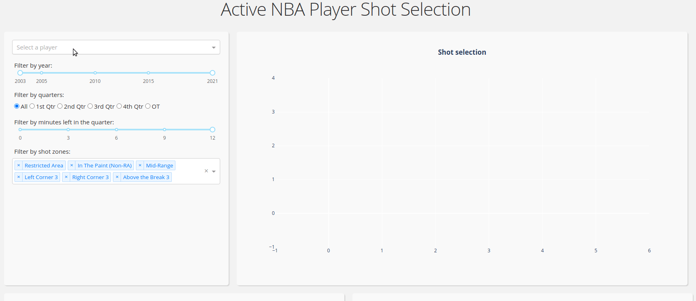

# NBA active player shot selection dashboard

This Dash app shows active NBA players' shot selections. Results are summarized by shot distance, shot type and shot location and can be filtered by year, period of game and shot zone.

## Running the app locally

Create a conda environment with `conda env create -f environment.yml`, then activate it by `conda activate nba-dash`. Run the app with `python app.py`.

## Built With

- [NBA API](https://github.com/swar/nba_api) - Python API client to source data from stats.nba.com
- [Dash](https://dash.plot.ly/) - Main server and interactive components
- [Plotly Python](https://plot.ly/python/) - Used to create the interactive plots

The dashboard template is larged based on [Dash Natural Gas Well Production Example](https://github.com/plotly/dash-sample-apps/tree/master/apps/dash-oil-and-ga). The NBA court drawing code is from this [tutorial](https://towardsdatascience.com/interactive-basketball-data-visualizations-with-plotly-8c6916aaa59e).

## Screenshots

